# Laboratorio 03 - TDD – Pruebas de Software – Agilismo y Scrum – Análisis de Requerimientos

**Integrantes :**
- Sebastian Albarracin Silva
- Raquel Iveth Selma Ayala
- Juan Pablo Nieto Cortes

**Nombre de la rama :**
`feature/lab3_Nieto_Albarracin_Selma_2025-2'

# Reto 1: Identificando los Requerimientos

## Reglas de Negocio
- Los números de cuenta deben tener exactamente **10 dígitos**.
- Solo son válidos si los **dos primeros dígitos corresponden a un banco registrado** (ejemplo: `01 → BANCOLOMBIA`, `02 → DAVIVIENDA`).
- Las cuentas **no pueden contener letras ni caracteres especiales**, únicamente números.
- Cada cuenta debe estar asociada a un cliente único.
- No se pueden realizar depósitos en cuentas inexistentes o inválidas.
- El sistema debe garantizar la integridad y seguridad de la información financiera.

## Funcionalidades Principales
1. **Crear cuenta bancaria**
    - Validar el número de cuenta según las reglas de negocio.
    - Asociar la cuenta a un cliente.
    - Iniciar con un saldo en cero.

2. **Validar cuentas**
    - Verificar que el número de cuenta cumpla los criterios de formato y banco válido.
    - Confirmar que la cuenta exista en el sistema.

3. **Consultar saldo**
    - Permitir al cliente visualizar el saldo actual de su cuenta.

4. **Realizar depósitos**
    - Registrar depósitos en cuentas válidas.
    - Actualizar el saldo de la cuenta de manera inmediata.
    - Generar trazabilidad del movimiento.

## Actores Principales
- **edu.dosw.lab.Reto4.Cliente**: Persona que posee una cuenta bancaria y realiza operaciones (consultar saldo, depositar).
- **Sistema edu.dosw.lab.Reto4.Bankify**: Aplicación que valida, administra y procesa las operaciones financieras.
- **Administrador/Operador del edu.dosw.lab.Reto4.Banco** (opcional en versiones iniciales): Encargado de registrar bancos válidos o realizar tareas de mantenimiento.

## Precondiciones
- El sistema debe tener configurados los **códigos de bancos válidos**.
- El cliente debe estar **registrado en el sistema** antes de crear una cuenta.
- La infraestructura necesaria debe estar disponible:

# Reto 2: Diseñando
- DIAGRAMA DE CASOS DE USO
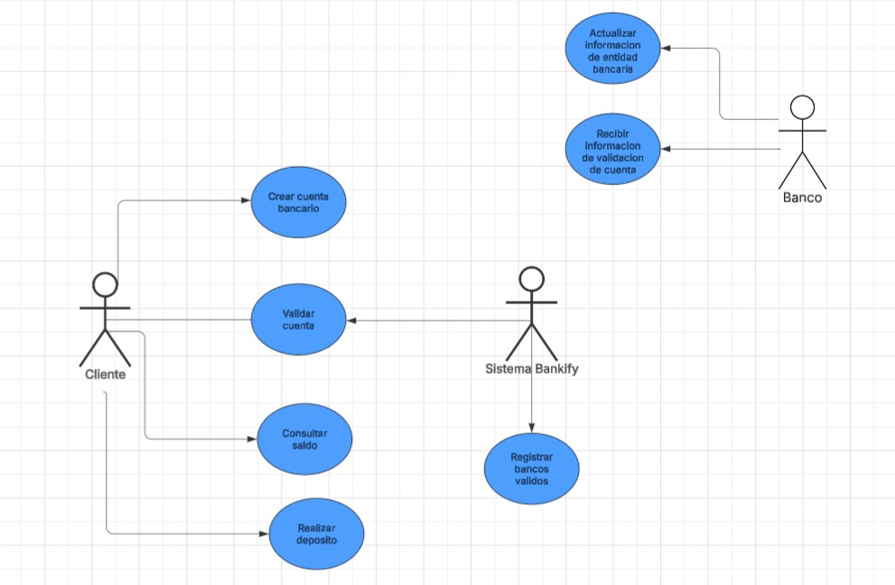

- EXCEL
  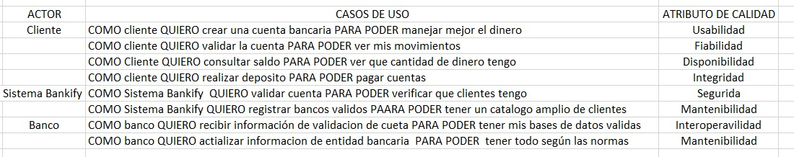

- DIAGRAMA DE CONTEXTO
  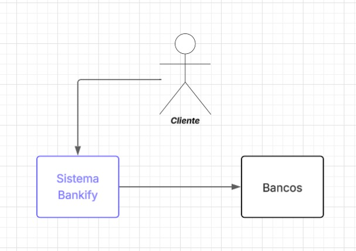

- DIAGRAMA DE CLASES
  
## Reto 3: Una estimación automatizada 
### completado 
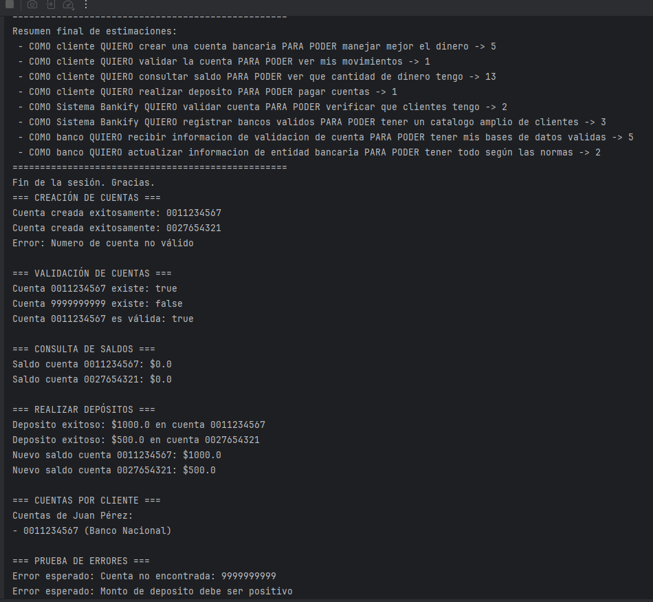

# Reto 4: Tiempo De Desarrollo

## Pruebas Unitarias 
- ### Bankify 

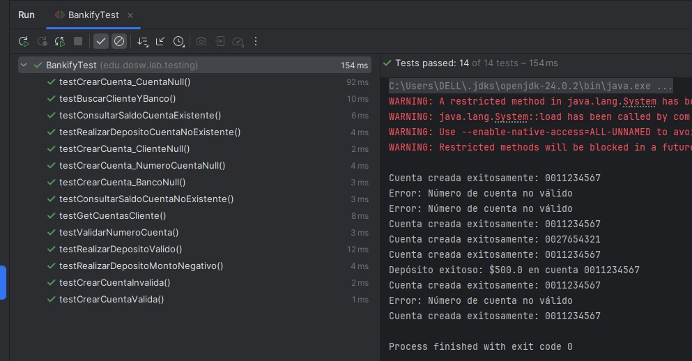

- ### Banco

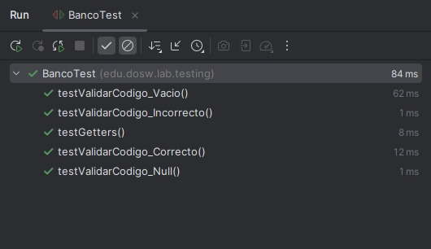

- ### Cliente

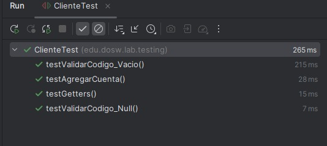

- ### Cuenta

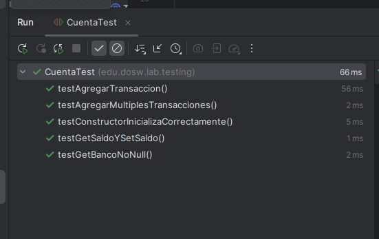

- ### Gestionar Cuentas

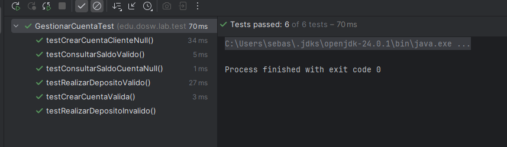

- ### Reto 4

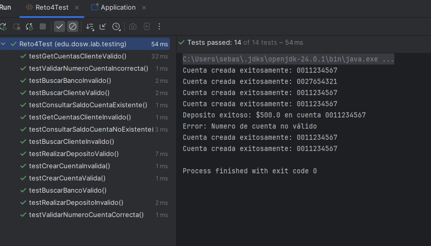

- ### Transacción

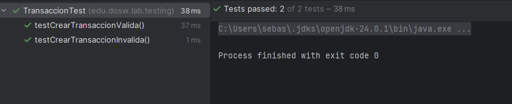

- ### Validar Cuenta

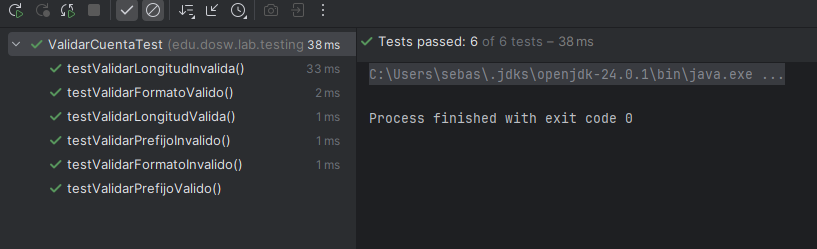

## Principios y Patrones 
### Patron Fachada
La clase `Bankify` actúa como una fachada que simplifica la interacción con varias clases y funcionalidades relacionadas con la gestión bancaria (clientes, cuentas, bancos, validaciones, transacciones).

- Oculta la complejidad de `GestionarCuenta`, `ValidarCuenta`, y la gestión de listas internas.
- Proporciona una interfaz simple para crear cuentas, validar números, consultar saldo, realizar depósitos, etc.

## Principios SOLID

### 1. SRP (Single Responsibility Principle)
Cada clase tiene una responsabilidad clara:

- `Banco` representa un banco.
- `Cliente` representa un cliente y sus cuentas.
- `Cuenta` representa una cuenta bancaria y sus transacciones.
- `GestionarCuenta` se encarga de operaciones sobre cuentas (crear, depositar, consultar saldo).
- `ValidarCuenta` se encarga de validar números de cuenta.
- `Bankify` coordina la interacción entre clientes, bancos, cuentas y validaciones.

Esto facilita mantenimiento y extensión.

### 2. OCP (Open/Closed Principle)
Las clases están diseñadas para ser extendidas sin modificar el código existente.

- Por ejemplo, `ValidarCuenta` podría extenderse para nuevas reglas de validación.

### 3. Encapsulamiento
- Los atributos son privados y se accede a ellos mediante getters/setters o métodos específicos.
- Esto protege el estado interno y permite controlar cómo se modifica.

### 4. Principio de Demeter (Law of Demeter)
- `Bankify` interactúa con otras clases a través de sus métodos públicos, evitando acceder directamente a atributos internos de otras clases.

---

## Otros Aspectos

- Uso de colecciones para almacenamiento en memoria (listas para clientes, cuentas y bancos).
- Uso de streams y expresiones lambda para búsquedas y filtrados.
- Validación y manejo de errores mediante excepciones (`IllegalArgumentException`).
- Separación clara entre validación y gestión de cuentas.

## Evidencia de java docs
### javadoc
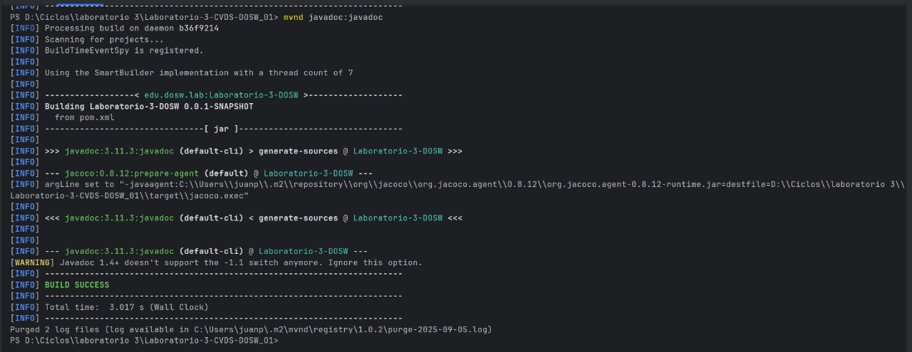
### Compilación
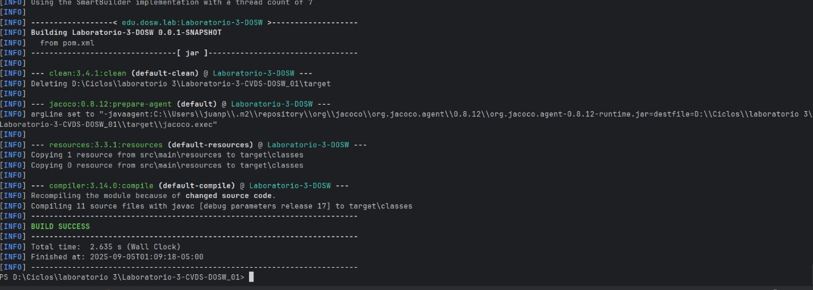
### Ejecución

