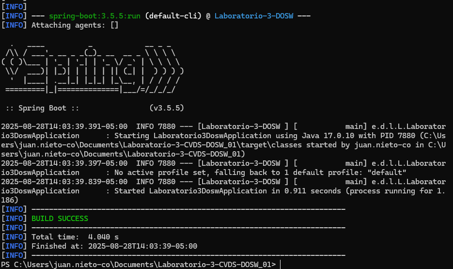

# Laboratorio 03 - TDD – Pruebas de Software – Agilismo y Scrum – Análisis de Requerimientos

**Integrantes :**
- Sebastian Albarracin Silva
- Raquel Iveth Selma Ayala
- Juan Pablo Nieto Cortes

**Nombre de la rama :**
`feature/lab3_Nieto_Albarracin_Selma_2025-2'

### Ejecusion del maven

