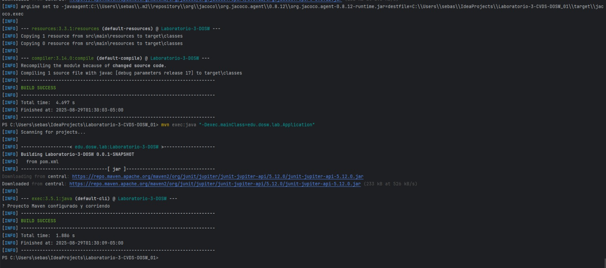

# Laboratorio 03 - TDD – Pruebas de Software – Agilismo y Scrum – Análisis de Requerimientos

**Integrantes :**
- Sebastian Albarracin Silva
- Raquel Iveth Selma Ayala
- Juan Pablo Nieto Cortes

**Nombre de la rama :**
`feature/lab3_Nieto_Albarracin_Selma_2025-2`

### Ejecucion del maven

### Otra imagen

### DIRECTORIOS CREADOS EN EL PROYECTO

### PLUGIN JACOBO PUESTO EN EL POM.XML

### EJECUTANDO Y CORRIENDO DESPUES DE LO HECHO POR EL SEGUNDO INTEGRANTE:

# 12. Respuestas  

## A. Diferencia entre una prueba unitaria y una prueba de integración E2E  
- **Prueba unitaria**: valida una función o método individual de forma aislada, asegurando que su lógica interna sea correcta.  
- **Prueba de integración E2E (end-to-end)**: valida el flujo completo del sistema desde la perspectiva del usuario final, verificando cómo interactúan los distintos módulos/componentes entre sí.  

**Ejemplo**:  
- *Unit test*: comprobar que la función `calcularTotal()` devuelve el valor correcto.  
- *E2E*: validar que un usuario puede registrarse, iniciar sesión, buscar una película y reproducirla sin errores.  

---

## B. Propósito de la Sprint Retrospective en Scrum  
La **Sprint Retrospective** busca que el equipo inspeccione cómo trabajó en el sprint y acuerde mejoras para el próximo. Es crucial porque:  
- Fomenta la **mejora continua**.  
- Da espacio a la **transparencia y reflexión**.  
- Permite identificar **impedimentos y buenas prácticas**.  

En resumen: ayuda a que el equipo no solo entregue software, sino que cada vez trabaje **mejor y más eficientemente**.  

---

## C. Diferencia entre Épica, Feature y User Story (ejemplo con un sistema tipo Netflix)  
- **Épica**: gran bloque de funcionalidad, a largo plazo, que se divide en features e historias.  
  - Ejemplo: *“Gestión completa de reproducción de videos en la plataforma”*.  

- **Feature**: subconjunto de una épica que aporta un valor más específico.  
  - Ejemplo: *“Funcionalidad de descarga de películas para ver offline”*.  

- **Historia de Usuario**: requisito detallado desde la perspectiva del usuario.  
  - Ejemplo: *“Como usuario quiero descargar una serie para verla sin conexión cuando no tenga internet”*.  

---

## D. Cobertura de código (code coverage)  
Es una métrica que indica qué porcentaje del código fuente fue ejecutado durante las pruebas automatizadas.  

**Por qué el 100% no garantiza ausencia de errores**:  
- Puede probar todas las líneas, pero no todos los **casos lógicos** ni combinaciones posibles.  
- No asegura la detección de errores de integración, rendimiento o seguridad.  

---

## E. Diagrama de Casos de Uso  
Un **diagrama de casos de uso** es una representación visual de las interacciones entre los **actores externos** (usuarios u otros sistemas) y el sistema en desarrollo.  

**Elementos**:  
- Actores  
- Casos de uso (funcionalidades del sistema)  
- Relaciones (asociación, inclusión, extensión)  
- Sistema (límites)  

**Utilidad**: durante el análisis de requerimientos permite **entender qué espera el usuario del sistema** y delimitar el alcance funcional.  

---

## F. Diferencia entre JUnit, Jacoco y SonarQube  
- **JUnit**: framework para ejecutar **pruebas unitarias** en Java.  
- **JaCoCo**: herramienta para medir la **cobertura de código** de las pruebas ejecutadas.  
- **SonarQube**: plataforma que integra métricas de JUnit y Jacoco, y además analiza la **calidad del código**, detectando *bugs, code smells, vulnerabilidades y deuda técnica*.  

En conjunto:  
- JUnit prueba.  
- JaCoCo mide qué tanto fue probado.  
- SonarQube evalúa la **calidad global** del software.  

---

## G. Ventajas del Planning Poker  
El **Planning Poker** es un método colaborativo de estimación ágil. Sus ventajas:  
- Promueve **participación de todo el equipo**.  
- Reduce el sesgo y la presión jerárquica.  
- Fomenta la **discusión y consenso**.  
- Da **transparencia** y mejora el **compromiso colectivo**.  

Comparado con métodos tradicionales (estimaciones impuestas por un líder o en horas exactas), genera estimaciones más realistas y compartidas.  

---

## H. Valores de Scrum y el más difícil de aplicar  
Los **5 valores de Scrum** son:  
1. Compromiso  
2. Coraje  
3. Enfoque  
4. Apertura  
5. Respeto  

El más difícil de aplicar suele ser el **coraje**, porque implica:  
- Decir cuando algo no funciona.  
- Reconocer errores y pedir ayuda.  
- Afrontar conversaciones difíciles con el cliente o dentro del equipo.  
